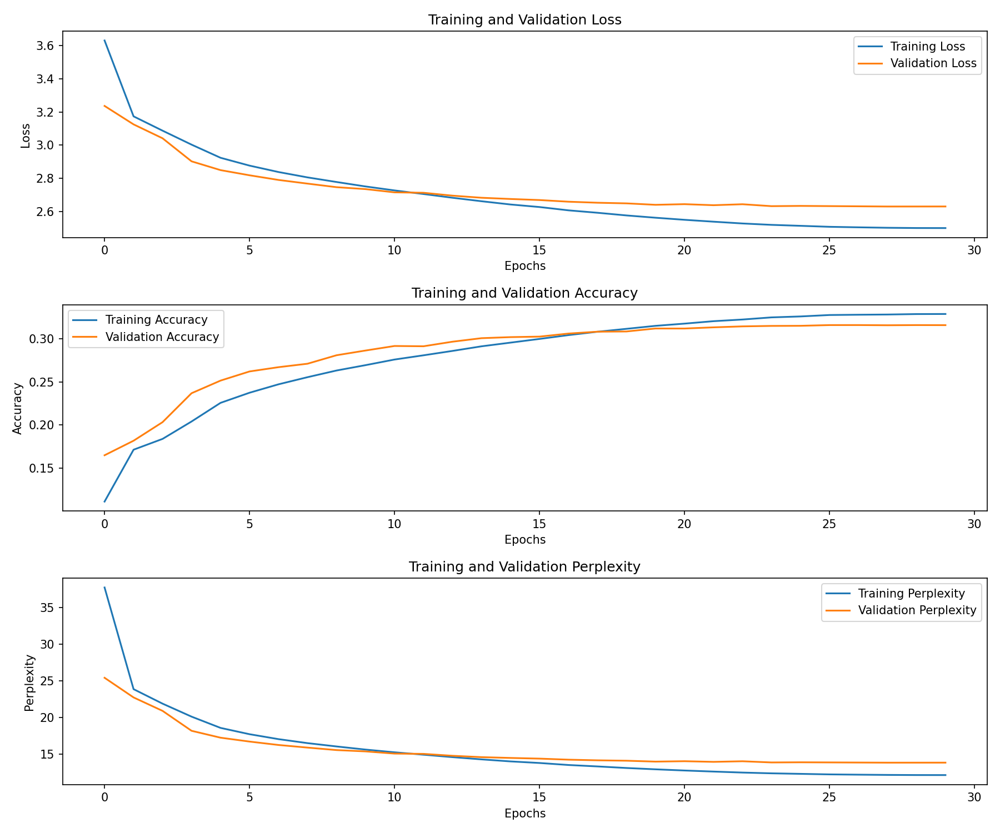
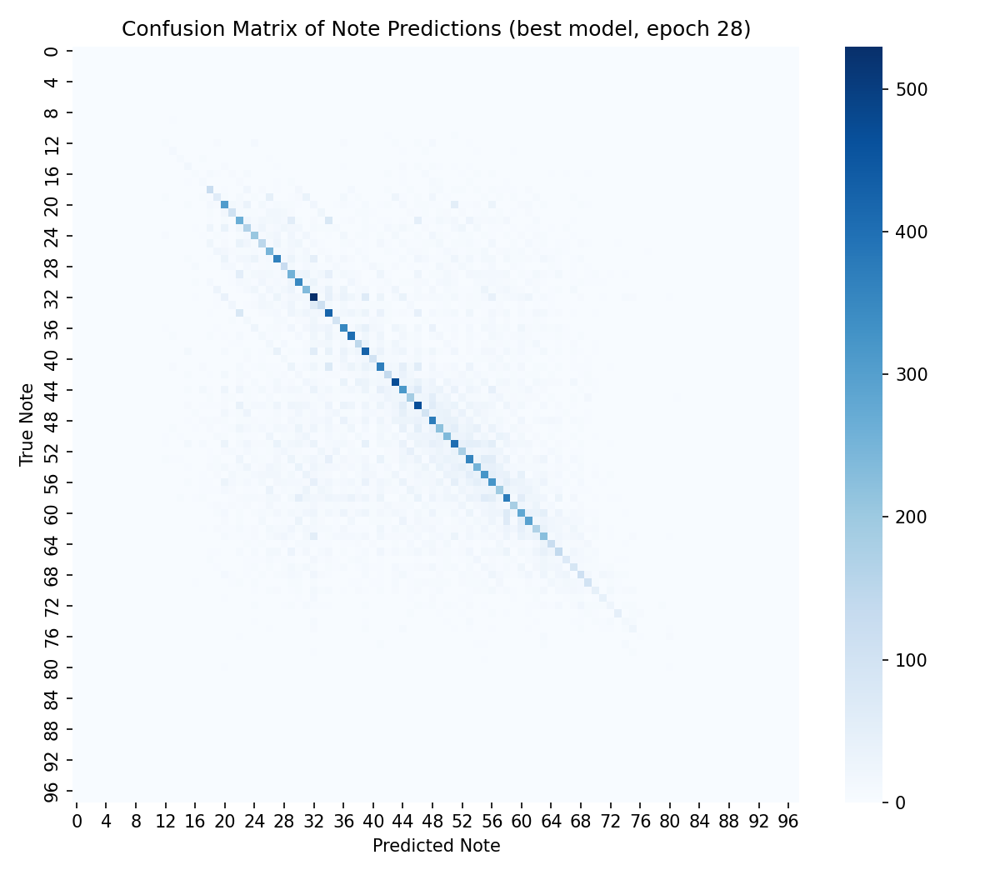
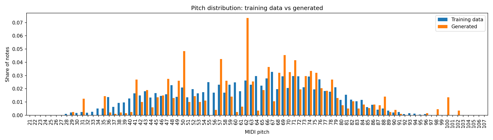
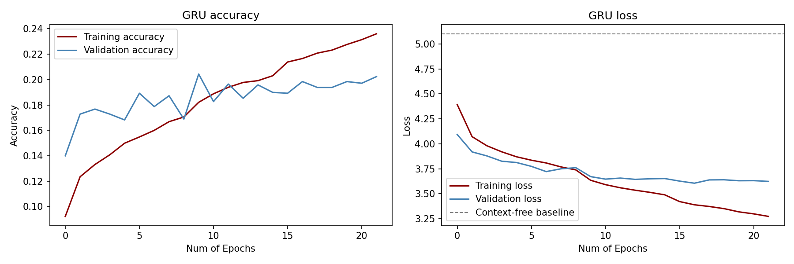
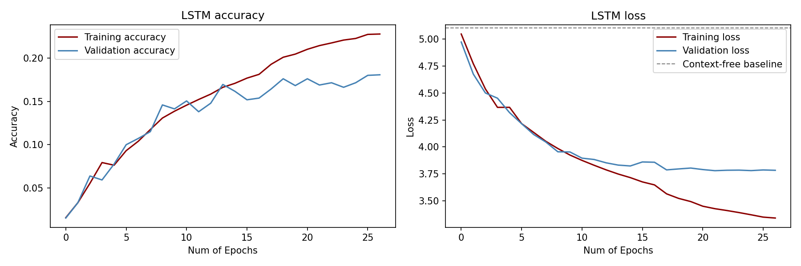
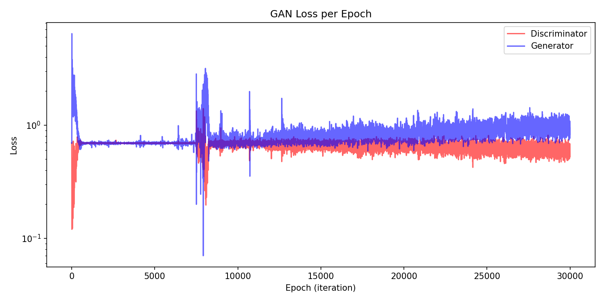
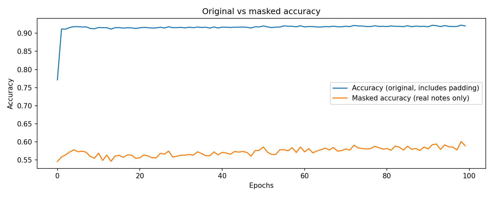
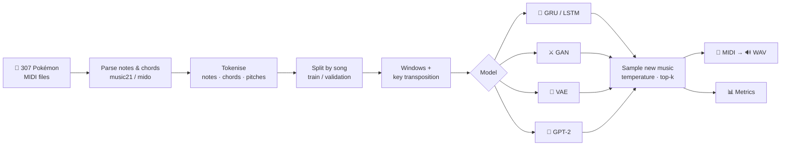

<div align="center">

# 🎼 Symphony of Algorithms

### Can a neural network learn to compose Pokémon music?

*Four generative deep-learning architectures, one MIDI corpus, one evaluation protocol.*


</div>

---

## 🎮 The idea

Symphony of Algorithms explores how different families of generative neural networks learn to write music. Every model is trained on the same dataset of **307 fan-transcribed Pokémon MIDI themes**, from Pallet Town to the Elite Four, and evaluated with the same set of metrics. That makes it possible to see what each architecture is good at: predicting the next note, inventing something new, or capturing the statistics of the corpus.

| | Model | How it "thinks" about music | Framework |
|---|---|---|---|
| 🔁 | **GRU** | Reads the last 100 notes one by one and predicts the next | Keras |
| 🔁 | **LSTM** | Same idea, with a longer-memory recurrent cell | Keras |
| ⚔️ | **GAN** | A generator invents 100-note phrases while an LSTM critic tries to spot the fakes | Keras |
| 🌌 | **VAE** | Compresses whole songs into a 64-number "latent space" and samples new songs from it | PyTorch |
| 🧠 | **Transformer (GPT-2)** | Self-attention: every note can look at every earlier note at once | PyTorch + 🤗 |

> Final-year B.Tech CSE (AI & ML) project, **Vellore Institute of Technology, Chennai**.

---

## 🏆 Results at a glance

| Model | Params | Validation accuracy (next note) | Validation perplexity ↓ | Highlight |
|---|---|---|---|---|
| 🧠 **Transformer** | 3.2 M | **31.6%** | **13.9** | Strongest next-note predictor; train and validation stay close for all 30 epochs |
| 🔁 **GRU** | 3.0 M | 19.8% | 36.8 | Perplexity 4.5× below the context-free baseline |
| 🔁 **LSTM** | 3.8 M | 16.9% | 43.8 | Perplexity 3.8× below the context-free baseline |
| ⚔️ **GAN** | 6.9 M | n/a | n/a | Stable adversarial training: the discriminator stays around 66% accurate |
| 🌌 **VAE** | 0.9 M | 58.9%* | n/a | 92.0% on all positions; 58.9% on real notes only |

<sub>*VAE accuracy is the share of real notes reconstructed on the correct side of the pitch threshold, excluding padding. The Transformer predicts pitches (99 tokens), while the GRU/LSTM predict notes **and chords** (714 tokens), so accuracies are best read within a model family. Every number here comes from the saved `metrics.json` files and notebook outputs in this repository.</sub>

---

## 📊 Detailed results

### 🧠 Transformer (GPT-2)

A GPT-2-style decoder (4 layers, 4 attention heads, 256-dim embeddings) trained from scratch as a next-note predictor on 50-note windows.

**Fine-tuning.** Performance improved substantially after fine-tuning the data pipeline and training setup:
- every note of each song is used, through overlapping 50-note windows
- notes are merged across tracks in playing order, and the drum channel is removed
- training windows are randomly transposed by −5 to +6 semitones
- a warmup + cosine learning-rate schedule, dropout 0.2, weight decay 0.1 and early stopping

| Metric (validation, best epoch 28 of 30) | Value |
|---|---|
| Loss | 2.630 |
| Accuracy | 31.6% |
| Perplexity | 13.9 |
| Precision / Recall / F1 (weighted) | 0.313 / 0.316 / 0.313 |
| Training accuracy | 32.9% |
| Data | 245 training songs (17,980 windows) · 62 validation songs (835 windows) |

Validation loss fell steadily throughout training, and training and validation accuracy stayed within about 1.3 points of each other, so the model generalises to songs it never saw. The confusion matrix shows a strong diagonal. Most mistakes land one or two semitones from the correct note, which is a musically sensible kind of error.

<p align="center"></p>

<p align="center">

</p>

**Generated music.** Each piece starts from the real 16-note opening of a validation song. The model continues it for 100 notes, using temperature 0.9 and top-k 10 sampling. The generated notes cover **62 distinct pitches**, spanning bass to treble. The five most frequent pitches make up 25.1% of generated notes, against 15.1% in the training data, a mild preference for each piece's home key.

<p align="center"></p>

| Generation metric (normalised pitch) | Value |
|---|---|
| Novelty (mean distance to real sequences) | 1.584 |
| Novelty (nearest real sequence) | 0.727 |
| Diversity | 1.582 |
| FAD proxy | 0.0011 |

### 🔁 GRU and LSTM

Two stacked recurrent layers (512 units) on top of a 128-dim token embedding, followed by Dense(256) and a softmax over 714 note and chord tokens. Both models read 100-token windows and predict the next token.

**Fine-tuning.** Performance improved after fine-tuning the input representation and optimisation:
- a learned embedding for every note and chord token
- Adam with gradient clipping, and the learning rate halves when validation loss stalls
- rare tokens merged into `<unk>`
- validation on held-out songs, random transposition of training windows, and early stopping

| Metric (validation) | GRU | LSTM |
|---|---|---|
| Best epoch / epochs run | 17 / 22 | 22 / 27 |
| Loss | 3.605 | 3.779 |
| Accuracy | 19.8% | 16.9% |
| Perplexity | 36.8 | 43.8 |
| Training accuracy | 21.7% | 21.4% |
| Context-free baseline loss (perplexity) | 5.103 (164.5) | 5.103 (164.5) |
| Novelty (mean distance / nearest) | 3.644 / 1.560 | 2.983 / 1.061 |
| Diversity | 3.639 | 1.657 |
| FAD proxy | 0.0035 | 0.0193 |

The **context-free baseline** is the loss of a model that only knows how common each token is. Both networks finish far below it, so they are really learning from the preceding notes. The GRU learned faster and generalised slightly better. After about 10–17 epochs, validation loss levels off while training loss keeps falling, and early stopping keeps the best checkpoint before overfitting sets in.

<p align="center"></p>

<details>
<summary>LSTM curves</summary>
<p align="center"></p>
The LSTM started more slowly (1.5% accuracy after the first epoch) and then followed the same path, reaching 16.9% validation accuracy.
</details>

Data: 264 songs longer than 100 tokens (128,106 tokens), split into 238 training songs (94,140 windows) and 26 validation songs.

### ⚔️ GAN

A generator (dense layers of 256 → 512 → 1024 units with batch normalisation and a tanh output, 1.02 M parameters) turns 1000-dim noise into a 100-note sequence. An LSTM discriminator (a 512-unit LSTM, then a bidirectional LSTM, then dense layers; 5.91 M parameters) judges real versus generated sequences. It was trained for 30,000 iterations with batch size 32 and Adam (2e-4, β₁ 0.5).

| Metric | Value |
|---|---|
| Final discriminator loss | 0.526 |
| Mean discriminator loss (last 1,000 iterations) | 0.606 |
| Mean discriminator accuracy (last 1,000 iterations) | 66.3% |
| Distinct tokens in a 500-note piece | 195 of 627 |
| Novelty (mean distance / nearest) | 10.14 / 7.70 |
| Diversity | 10.32 |
| FAD proxy | 0.269 |

Training stayed balanced throughout. The discriminator sat near 50% accuracy for the first half of the run and around 60–70% in the second half, so it never overpowered the generator and kept giving it useful feedback. The generator produced varied output, with 195 different notes and chords in one piece and no sign of mode collapse.

<p align="center"></p>

### 🌌 VAE

A fully connected variational autoencoder over whole songs: a linear encoder (256 units), a 64-dim latent space and a linear decoder with a sigmoid output. Each song is a sequence of MIDI pitches divided by 127, zero-padded to the longest song (1,604 notes). It was trained for 100 epochs with BCE + KL loss and Adam at 1e-3.

| Metric (epoch 100) | Value |
|---|---|
| Total loss | 7,224.5 |
| Reconstruction loss | 6,938.8 |
| KL divergence | 285.8 |
| Accuracy, all positions | 92.0% |
| **Accuracy, real notes only** | **58.9%** |
| Novelty (mean distance / nearest) | 1.383 / 0.572 |
| Diversity | 0.832 |
| FAD proxy | 0.0047 |

**Why two accuracy numbers?** Songs are padded to the longest one, so **80.6% of every input is padding**. Measured over all positions, accuracy is 92.0%. Measured over real notes only, it is 58.9%. The second number is the one that reflects what the model has learned about music. The decoded one-minute piece contains 480 notes across 56 distinct pitches.

<p align="center"></p>

---

## 🎧 Listen

Every model writes its composition as MIDI, and the GRU, LSTM, GAN and VAE notebooks also render it to WAV. Click a file on GitHub, then **Download** to play it.

| Model | Audio |
|---|---|
| 🔁 GRU | [`gru_improved_generated.wav`](results/gru_lstm_results/audio/gru_improved_generated.wav) · [`.mid`](results/gru_lstm_results/audio/gru_improved_generated.mid) |
| 🔁 LSTM | [`lstm_improved_generated.wav`](results/gru_lstm_results/audio/lstm_improved_generated.wav) · [`.mid`](results/gru_lstm_results/audio/lstm_improved_generated.mid) |
| ⚔️ GAN | [`gan_generated.wav`](results/gan_results/audio/gan_generated.wav) · [`.mid`](results/gan_results/audio/gan_generated.mid) |
| 🌌 VAE | [`vae_generated.wav`](results/vae_results/audio/vae_generated.wav) · [`.mid`](results/vae_results/audio/vae_generated.mid) |
| 🧠 Transformer | [`transformer_generated.mid`](results/transformer_results/audio/transformer_generated.mid) (16-note real opening + 100 generated notes) |

---

## ⚙️ How it works



**Evaluation metrics:**

| Metric | What it tells you |
|---|---|
| **Accuracy** | How often the predicted next note is exactly right |
| **Perplexity** | How many notes the model is effectively "choosing between"; lower is more confident |
| **Precision / Recall / F1** | Per-note prediction quality, weighted by how often each note occurs |
| **Novelty** | Distance from generated music to real music: is it copying or inventing? |
| **Diversity** | Distance between generated pieces: does it always write the same tune? |
| **FAD proxy** | How closely generated note statistics match the real corpus |
| **Confusion matrix** | *Which* notes get mixed up, not just how often |

Novelty, diversity and FAD are computed in each model's own representation, so read them within a model rather than across models.

---

## 📁 Repository structure

```
symphony_of_algorithms_final/
├── data/
│   └── pokemon_midis.zip              # 307 MIDI files (the training corpus)
├── notebooks/
│   ├── 01_gru_lstm_music_generation.ipynb
│   ├── 02_gan_music_generation.ipynb
│   ├── 03_vae_music_generation.ipynb
│   └── 04_transformer_music_generation.ipynb
├── results/
│   ├── gru_lstm_results/              # figures/, audio/, gru_improved_metrics.json, lstm_improved_metrics.json
│   ├── gan_results/                   # figures/, audio/, gan_metrics.json
│   ├── vae_results/                   # figures/, audio/, vae_metrics.json
│   └── transformer_results/           # figures/, audio/, transformer_metrics.json
├── docs/
│   ├── project_report.pdf / .docx     # full project report
│   ├── research_paper.doc             # conference-format paper
│   ├── presentation.pptx              # project presentation
│   └── metrics_comparison.docx        # metrics table
├── requirements.txt
└── README.md
```

---

## 🚀 Run it yourself

Every notebook is self-contained and built for **Google Colab**:

1. Open [colab.research.google.com](https://colab.research.google.com) → **File → Upload notebook** → pick one from `notebooks/`.
2. **Runtime → Change runtime type → T4 GPU**.
3. **Runtime → Run all**. When prompted, upload `data/pokemon_midis.zip`.
4. The notebook trains the model, saves the figures and metrics, renders the music to audio and plays it inline, then downloads everything as a zip.

The GRU/LSTM notebook is the longest. On a T4 the GRU took about 30 minutes and the LSTM about 40, so it saves progress to Google Drive and resumes automatically if Colab disconnects.

Running locally works too:

```bash
pip install -r requirements.txt
```

Then open the notebooks from inside the repo. WAV rendering additionally needs [FluidSynth](https://www.fluidsynth.org/). Without it, the notebooks still save the `.mid` files.

---

## ⚠️ Limitations

- **Accuracy is not musicality.** Next-note accuracy rewards predicting the most common continuation. Generated pieces can fall into repetitive loops, especially from the GRU/LSTM (17–18 distinct tokens in a 500-note piece).
- **No listening study.** The report designs a human-evaluation protocol (harmony, rhythm, coherence, emotion), but it was not carried out.
- **Rhythm is not modelled.** Every model predicts *which* note comes next, not *when* or for how long. Generated notes are evenly spaced.
- **One small corpus.** 307 fan transcriptions of one franchise. How well this generalises to other genres is untested.

## 🔮 Where this could go next

- Tokens that encode **timing and duration** (e.g. REMI / event-based encodings), so rhythm is learned too
- **Pretraining** on a large MIDI corpus (Lakh MIDI, MAESTRO), then fine-tuning on Pokémon themes
- A small **listening test** to check how the metrics line up with what people actually enjoy

---

## 👩‍💻 Team

**Hamshika R** · **Harshita Rajinikanth** · **Snehalatha Prakash**

Supervised by **Dr. Harini S**, School of Computer Science and Engineering, VIT Chennai.

## 📚 Key references

- Vaswani et al. (2017). [Attention Is All You Need](https://arxiv.org/abs/1706.03762)
- Radford et al. (2019). [Language Models are Unsupervised Multitask Learners (GPT-2)](https://cdn.openai.com/better-language-models/language_models_are_unsupervised_multitask_learners.pdf)
- Huang et al. (2018). [Music Transformer: Generating Music with Long-Term Structure](https://arxiv.org/abs/1809.04281)
- Goodfellow et al. (2014). [Generative Adversarial Networks](https://arxiv.org/abs/1406.2661)
- Dong et al. (2017). [MuseGAN: Multi-track Sequential GANs for Symbolic Music Generation](https://arxiv.org/abs/1709.06298)
- Kingma & Welling (2013). [Auto-Encoding Variational Bayes](https://arxiv.org/abs/1312.6114)
- Cho et al. (2014). [Learning Phrase Representations using RNN Encoder–Decoder (GRU)](https://arxiv.org/abs/1406.1078)

## 📄 Licence

The code in this repository is released under the [MIT License](LICENSE).

The Pokémon MIDI corpus in `data/` is third-party fan-transcribed material included for reproducibility and is **not** covered by that licence. The underlying compositions belong to their respective copyright holders (Nintendo / Game Freak / The Pokémon Company).

<div align="center">

*Made with 🎵 and a lot of GPU hours.*

</div>
